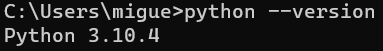
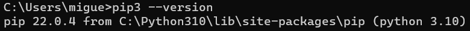
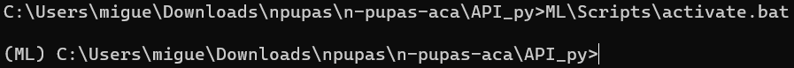
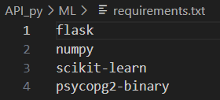
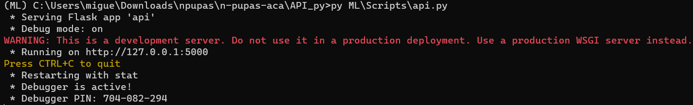

## Un poco sobre  N-Pupas
N-Pupas es una aplicación que permitirá a familias emprendedoras de pequeños negocios de pupuserías informales una ayuda en la administración de su negocio proyectando futuras inversiones de entes tanto gubernamentales como no gubernamentales almacenando un registro contable de las transacciones realizadas desde el momento que se utilice la aplicación y ayudando a emprendedores de clase baja o media que no pueden costear un sistema de índole privada a tener un acercamiento más directo y didáctico con los sistemas informáticos. Disminuyendo la brecha digital que se encuentra dentro del mercado competitivo de restaurantes, viéndose afectados los pequeños negocios por la gran capacidad adquisitiva de las grandes marcas.


## Manual de Usuario
Disponible en [este enlace.](https://drive.google.com/file/d/1bGsCUY9LilrOptfKdf-Z_1Gl27ygt9Zd/view?usp=sharing)

## Manual técnico
Puedes consultar información técnica acerca del proyecto en [nuestra Wiki](https://github.com/carolinamcc15/n-pupas-aca/wiki).

## Instalación de API RestFul (Creada por Miguel Herrera - 00041006)
1. Debe tener instalada la versión ```3.10.4``` de Python y la versión ```pip3 --version``` deberá ser la ```22.0.4```
    

2. Dentro de la carpeta ```n-pupas-aca/API_py/``` ejecutar los siguientes comandos:

   2.1 ```python -m venv ML``` el cual creará un ambiente de desarrollo de Python (ya existe la carpeta ML, por lo cual solo la definirá como ambiente de Python para la máquina donde se ejecute)

   2.2 ```copy ML\bin\DBConn.py ML\Scripts\``` el cual copiará el archivo ```DBConn.py``` de la carpeta ```bin``` a la carpeta ```Scripts```

   2.3 ```copy ML\bin\api.py ML\Scripts\``` el cual copiará el archivo ```api.py``` de la carpeta ```bin``` a la carpeta ```Scripts```

   2.4 ```ML\Scripts\activate.bat``` este comando activará el ambiente de Python. Para evidenciarlo, al inicio de la linea de comandos colocará "(ML)"

   

   2.5 ```pip3 install -r ML\requirements.txt``` este comando instalará todas las librerías necesarias para la ejecucion de la API. Estas son las librerías que instalará

   

   2.6 ```py ML\Scripts\api.py``` este comando pondrá en ejecución la API
   
