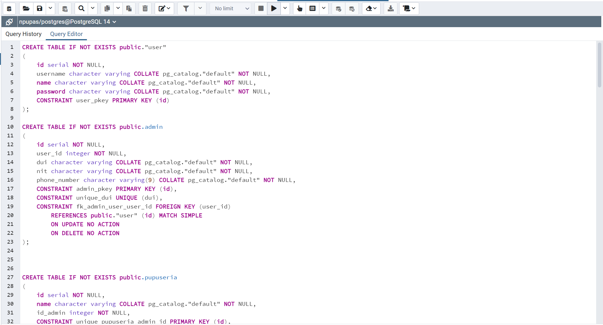
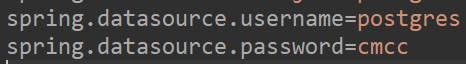
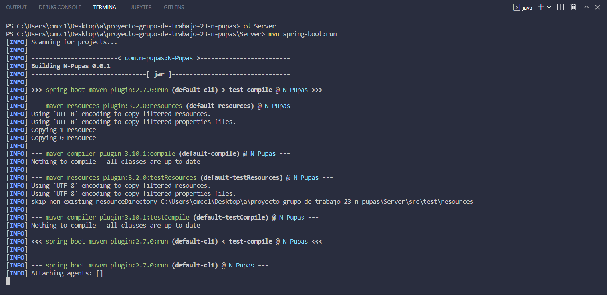
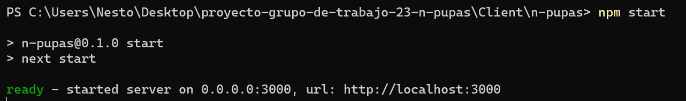

## Un poco sobre  N-Pupas
N-Pupas es una aplicación que permitirá a familias emprendedoras de pequeños negocios de pupuserías informales una ayuda en la administración de su negocio proyectando futuras inversiones de entes tanto gubernamentales como no gubernamentales almacenando un registro contable de las transacciones realizadas desde el momento que se utilice la aplicación y ayudando a emprendedores de clase baja o media que no pueden costear un sistema de índole privada a tener un acercamiento más directo y didáctico con los sistemas informáticos. Disminuyendo la brecha digital que se encuentra dentro del mercado competitivo de restaurantes, viéndose afectados los pequeños negocios por la gran capacidad adquisitiva de las grandes marcas.

##  Usuarios de Prueba

### Admin
* **Usuario** : carolinamcc
* **Contraseña** : 111111

### Empleado
* **Usuario** : michellelopez
* **Contraseña** : Aa12345678!

## Manual de Usuario


## Aplicación con nueva interfaz
https://software-engineer-project-ultimate.vercel.app/login


## Aplicación anterior
- https://n-pupas.vercel.app/


## Guía de Instalación
### Tecnologías y prerrequisitos
La aplicación y sus componentes han sido utilizados y desarrollados en entorno local haciendo uso de las siguientes versiones de tecnologías, en el sistema operativo Windows 11. 
### Base de datos
  * PostgreSQL 14
  * PgAdmin 4

### Web Service
  * Java Runtime 18
  * Java Spring Boot 2.7.0
  * Spring Tools Suite 4

### Cliente Web
  * Next JS 12.1.5
  * React 18.1.0
  * Node JS 16.3.0
  * Npm 7.15.1

## Instalación de base de datos
  Con el objetivo de tener persistencia de datos en nuestra aplicación se debe contar con una base de datos. Para el caso, se utilizará PostgreSQL como gestor de base de datos.

  1. Ejecutar PgAdmin e ingresar credenciales de usuario. 
  2. Dar clic en ```Servers -> PostgreSQL 14 -> Databases```.
  3. Clic derecho en y luego clic en ```create -> database```.
  4. Dentro del campo escribir el nombre de la base de datos como ```npupas```. 
  5. clic derecho sobre ```npupas``` y luego clic en ```query tool```. 
  6. En el campo de texto de ```Query Editor``` pegar todo el contenido de [DDL.sql](./Data/DDL.sql) sustituyendo cualquier contenido existente.
  7. Presionar ```F5``` para ejecutar el contenido de ```Query Editor```.
  8. Repetir los pasos 6 y 7 con [DML.sql](./Data/DML.sql).



## Instalación de servicio Web
1. Modificar el contenido de ```Server/src/main/resources/application.properties``` asignando las credenciales para la base de datos. 

2. Dentro de la carpeta ```Server/``` ejecutar el comando ```mvn spring-boot:run```.


## Instalación de cliente web
1. Dentro de la carpeta ``` Client/n-pupas/``` ejecutar el comando ```npm install```.
2. Dentro de la misma carpeta ejecutar el comando ```npm run build```.
3. Dentro de la misma carpeta ejecutar el comando ```npm start```.
4. Puede acceder a la aplicación por medio de un navegador consultando la dirección [http://localhost:3000](http://localhost:3000).



## Instalación de API RestFul Windows (Creada por Miguel Herrera - 00041006)
1. Debe tener instalada la versión ```3.10.4``` de Python y la versión ```pip3 --version``` deberá ser la ```22.0.4``` (./Images/PythonVersionWindows.png)(./Images/Pip3VersionWindows.png)
2. Dentro de la carpeta ```n-pupas-aca/API_py/``` ejecutar los siguientes comandos:
2.1 ```python -m venv ML``` el cual creará un ambiente de desarrollo de Python (ya existe la carpeta ML, por lo cual solo la definirá como ambiente de Python para la máquina donde se ejecute)
2.2 ```copy ML\bin\api.py ML\Scripts\``` el cual copiará el archivo ```api.py``` de la carpeta ```bin``` a la carpeta ```Scripts```
2.3 ```ML\Scripts\activate.bat``` este comando activará el ambiente de Python. Para evidenciarlo, al inicio de la linea de comandos colocará "(ML)" (./Images/ActivatedEnvironmentWindows.png)
2.4 ```pip3 install -r ML\requirements.txt``` este comando instalará todas las librerías necesarias para la ejecucion de la API. Estas son las librerías que instalará (./Images/RequiredLibraries.png)
2.5 ```py ML\Scripts\api.py``` este comando ejecutará la API (./Images/ExcecutedAPIWindows.png)
